# Ribat

Multi-tenant management system for mosque education: Quran memorization and book-explanation
courses, members and their families, teachers, schedules built around prayer times, and a full
audit trail. Installable PWA in Arabic (RTL) and English.

[](https://github.com/Salad-man3/ribat/actions/workflows/ci.yml)

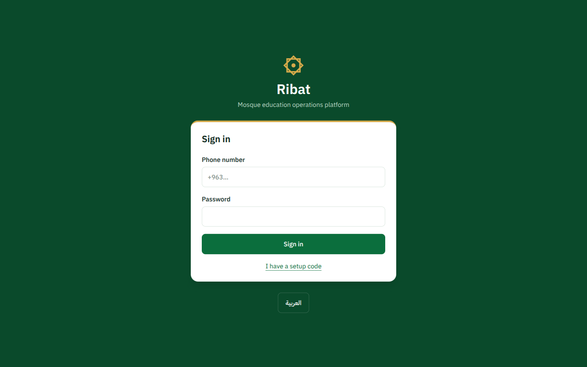

## Status

**Slice S1 (people and access) is done; slice S2 (courses and scheduling) is landing now.**
Not deployed yet. Attendance, progress logs, homework and offline sync are the next slices.

| Area | State |
| --- | --- |
| Accounts, sessions, roles, audit log | Done |
| Members, households, guardians, private notes, CSV import | Done |
| Courses, teachers, enrollment, groups, materials | Done, being polished |
| Weekly schedule anchored to prayer times, holidays, generated sessions | Done, being polished |
| Attendance, progress, homework, offline sync, notifications | Not started |

## What it does today

### For the mosque's staff (sheikh and admins)

| | |
| --- | --- |
| 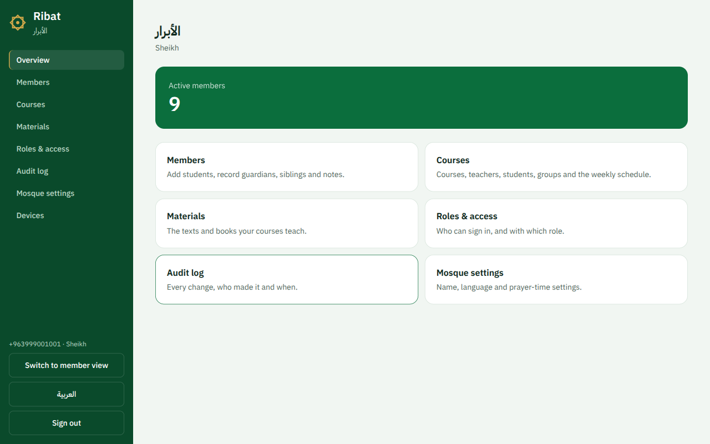 | 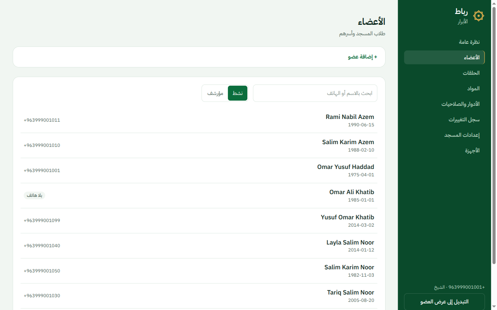 |
| **Overview.** Every tool the signed-in role is allowed to use, nothing else. | **Members, in Arabic.** Search and filter by status; the whole UI flips to right-to-left. |
| 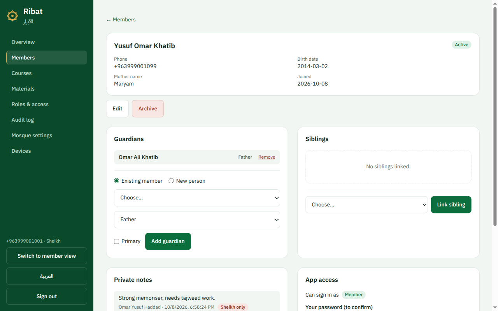 | 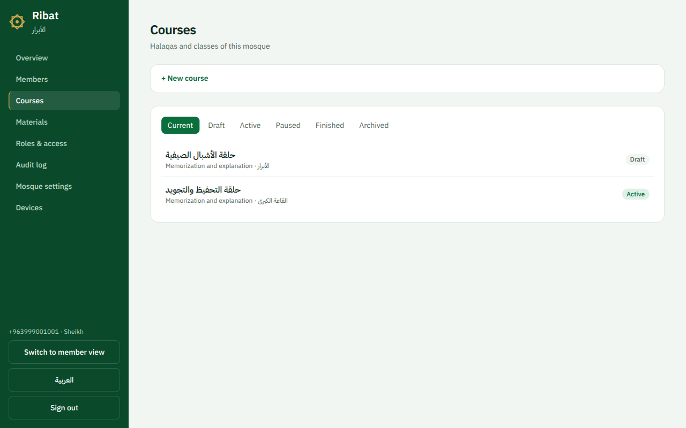 |
| **A member.** Guardians, siblings in the same household, private staff notes with their own visibility, and app access issued with a one-time setup code. | **Courses.** Draft, active, paused, finished and archived, with the lifecycle enforced by the API. |
| 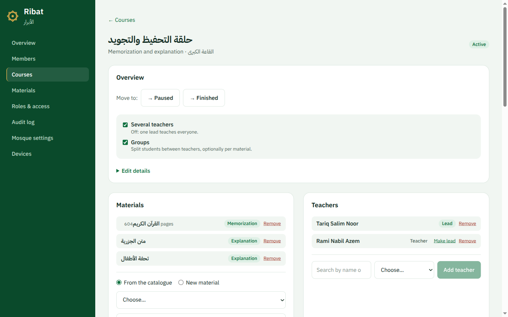 | 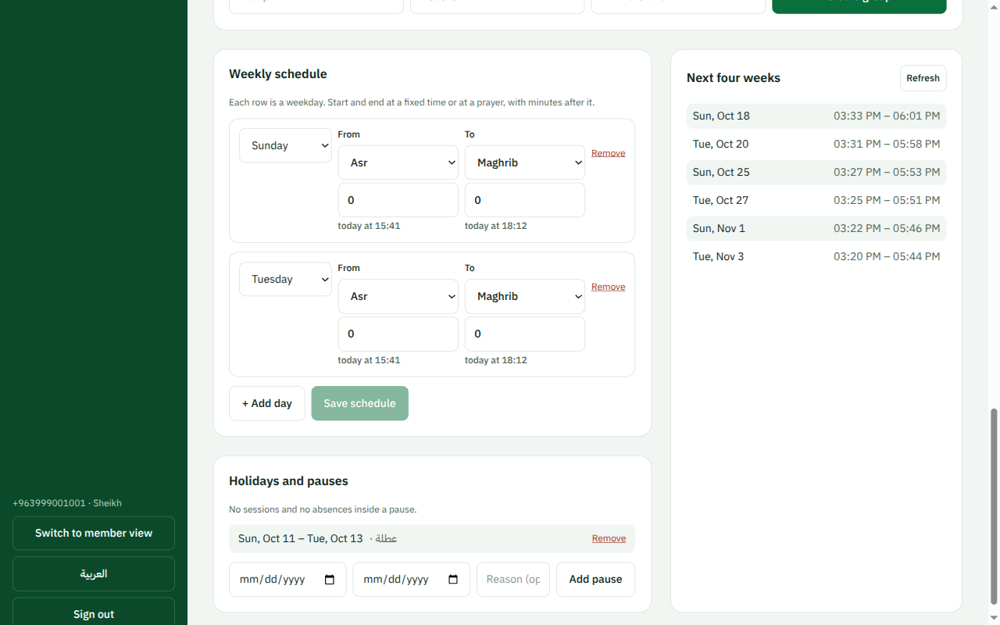 |
| **A course.** Materials from the mosque's catalogue, a lead teacher and assistants, enrollment and groups. | **Schedule.** Classes start and end at a prayer ("from Asr to Maghrib") or at a fixed time; holidays pause them, and the next four weeks of sessions are generated. |
| 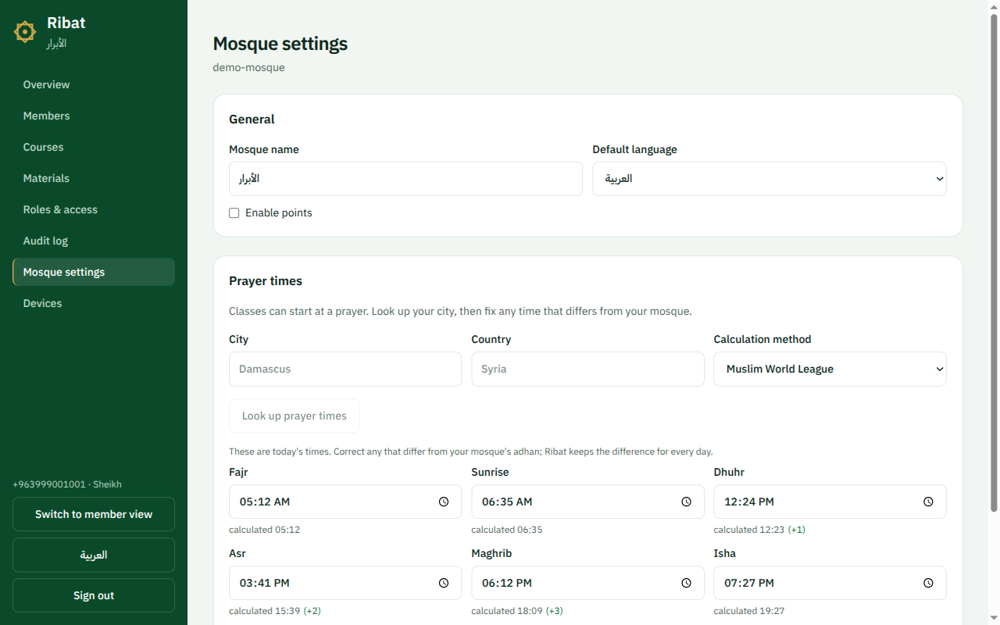 | 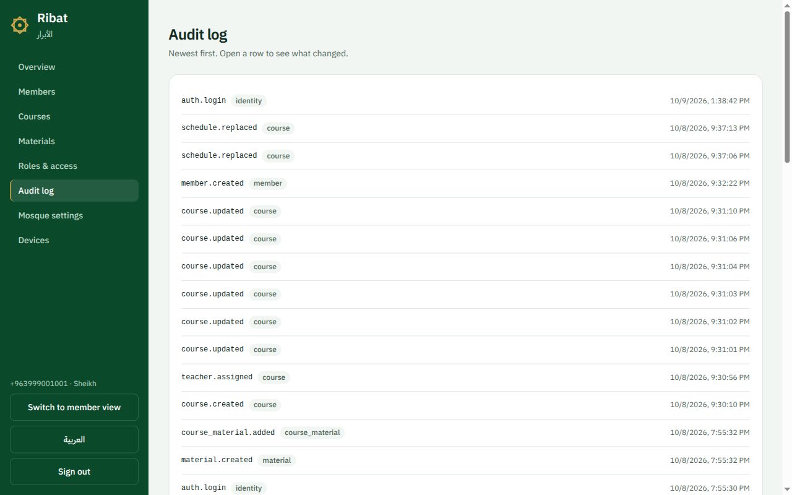 |
| **Prayer times.** Look up the city, then correct any prayer to match the mosque's own adhan; the offset is kept for every day. | **Audit log.** Every login and every change to people, roles and courses, with who did it and the request it came from. |
| 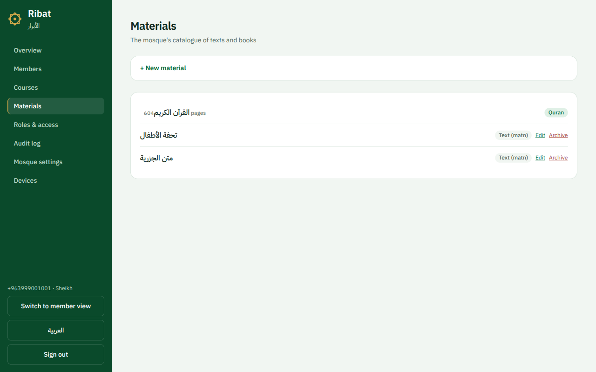 | |
| **Materials.** The Quran (604 pages) and the texts (mutun) the mosque teaches. | |

### For members and families

| | |
| --- | --- |
| 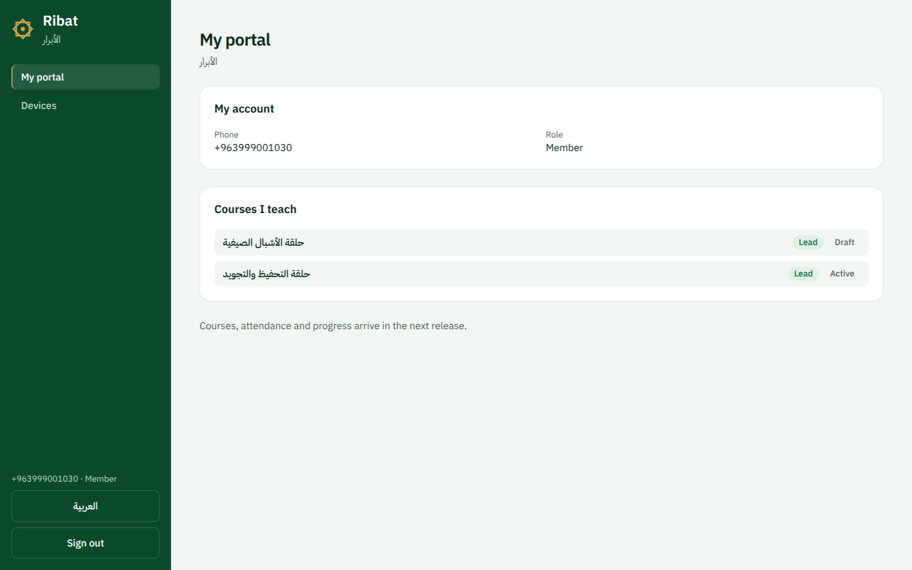 | 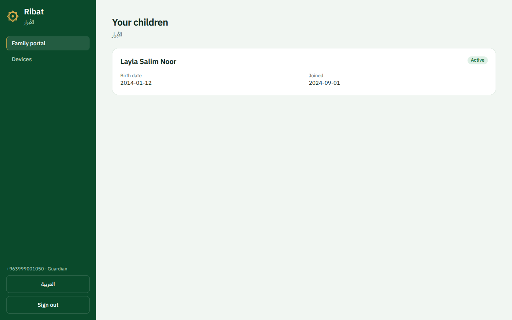 |
| **Member portal.** A member who also teaches sees the courses they lead. | **Family portal.** A guardian sees only their own children, enforced by the API, not just hidden in the UI. |

## How it is built

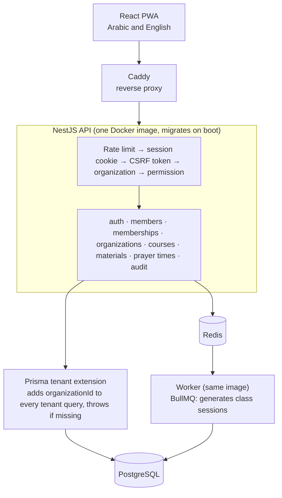

- **Tenant isolation in one place.** Many mosques share one schema. A Prisma client
  extension injects `organizationId` into every query on a tenant table and throws if a
  query reaches one without it. The e2e suite runs against two organizations and checks that
  the other one's records come back as 404. See [ADR-0002](docs/engineering/adr/0002-tenant-isolation.md).
- **Accounts without email.** Staff create people; a one-time setup code (hashed, 7 days,
  single use) lets the person choose their own password, hashed with Argon2id. Login and
  setup are rate-limited per IP. See [ADR-0003](docs/engineering/adr/0003-authentication.md).
- **Revocable cookie sessions.** Sessions live in the database, so signing a device out or
  changing a password ends access immediately. Every unsafe request carries a CSRF token
  bound to the session.
- **Roles shape responses, not just routes.** Sheikh, admin, member and guardian get
  different fields from the same member endpoint; private notes never leave the server for
  roles that may not see them.
- **Audit everything that matters.** An append-only log records the actor, the change and
  the request ID, which also appears on every Pino log line for that request.
- **Shared contracts.** Request and response schemas are Zod, in `packages/shared`, used by
  both the API and the PWA.

## Stack

| Layer | Choice |
| --- | --- |
| API | NestJS 11, TypeScript, Prisma 6, PostgreSQL 16, Redis 7, BullMQ |
| Web | React 19, Vite 6, Tailwind CSS 4, TanStack Query, React Router, i18next, PWA |
| Shared | Zod contracts (`packages/shared`), Quran reference data (`packages/quran-data`) |
| Prayer times | `adhan` for calculation, Aladhan for city lookup, per-prayer mosque offsets |
| Monorepo | pnpm workspaces, Turborepo |
| Quality | Oxlint, Prettier, `tsc --noEmit`, Jest, Vitest, Supertest e2e |
| Deploy | One Docker image (API + built PWA), a worker from the same image, Caddy in front |

## Quick start

**Prerequisites:** Node 20+, pnpm 12, Docker.

```bash
pnpm install
cp .env.example .env
cp .env.example apps/api/.env      # the Prisma CLI reads apps/api/.env
docker compose -f deploy/compose.dev.yml up -d
pnpm db:migrate
pnpm db:seed                       # wipes and recreates the demo data
pnpm dev
```

- PWA: http://localhost:5173
- API: http://localhost:3000/api/v1/health/live

Postgres listens on **5435** and Redis on **16379** so they don't clash with other local
services.

### Demo accounts

All demo accounts use the password `demo-ribat-2026`. The data is fictional.

| Phone | Role | Sees |
| --- | --- | --- |
| `+963999001001` | Sheikh | Everything in Demo Mosque, including private notes |
| `+963999001010` | Admin | Members, courses and settings |
| `+963999001030` | Member | Their own portal and the courses they teach |
| `+963999001050` | Guardian | Their own children only |
| `+963999002001` | Sheikh, Isolation Test Mosque | Nothing from Demo Mosque |

### Import members from CSV

```bash
pnpm --filter api import:members --file=members.csv --org=demo-mosque
```

The import validates every row first and writes nothing if any row fails.

## Commands

| Command | Does |
| --- | --- |
| `pnpm dev` | API (:3000) and PWA (:5173) with reload |
| `pnpm build` | Production build of all packages |
| `pnpm lint` | Oxlint across the monorepo |
| `pnpm typecheck` | TypeScript check of all packages |
| `pnpm test` | Unit tests (API, web, shared) |
| `pnpm test:e2e` | API integration tests against real Postgres and Redis |
| `pnpm db:migrate` | Apply Prisma migrations |
| `pnpm db:seed` | Reset the demo data |
| `pnpm db:studio` | Open Prisma Studio |

CI runs lint, typecheck, unit tests, e2e tests and the build on every push.

## Production

```bash
SESSION_SECRET=$(openssl rand -hex 32) docker compose -f deploy/compose.prod.yml up -d --build
```

One image serves the API and the built PWA and runs migrations on boot; a second container
from the same image consumes the job queue; Caddy sits in front on port 80. Put a domain in
`deploy/Caddyfile` instead of `:80` and Caddy fetches the HTTPS certificate itself.

## Documentation

Start at [docs/README.md](./docs/README.md). Architecture decisions are in
[docs/engineering/adr/](./docs/engineering/adr/).

## Licence

AGPL-3.0 — see [LICENSE](./LICENSE) and [ADR-0007](./docs/engineering/adr/0007-licence-and-visibility.md).
