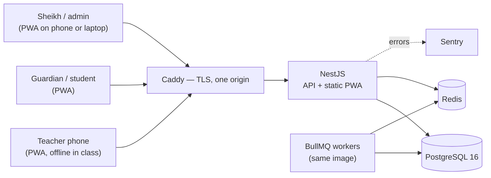

# 01 — Architecture

---

## 1. Stack

| Layer | Choice | ADR |
| --- | --- | --- |
| API | NestJS (Express), TypeScript, modular monolith | [0001](./adr/0001-stack-and-repo.md) |
| Database | PostgreSQL 16, Prisma | [0001](./adr/0001-stack-and-repo.md) |
| Tenancy | `organizationId` everywhere + scoped Prisma client; RLS after the beta | [0002](./adr/0002-tenant-isolation.md) |
| Auth | Own implementation: argon2id, httpOnly cookie sessions, CSRF double submit | [0003](./adr/0003-authentication.md) |
| Frontend | React + Vite PWA, TanStack Query, Dexie, Tailwind + shadcn/ui | [0001](./adr/0001-stack-and-repo.md) |
| Offline | Workbox service worker, Dexie cache and outbox, idempotent replay | [0004](./adr/0004-offline-sync.md) |
| Async work | Redis + BullMQ | [0006](./adr/0006-async-work.md) |
| Events | Domain events on a transactional outbox, from S4 | [0009](./adr/0009-events-and-outbox.md) |
| Read models | Transactional summary, nightly statistics, both rebuildable | [0010](./adr/0010-read-models.md) |
| Distribution | Open source plus managed hosting; two deployment modes | [0008](./adr/0008-distribution-model.md) |
| Contracts | Zod schemas in `packages/shared`, used by API and PWA | [0001](./adr/0001-stack-and-repo.md) |
| Licence | AGPL-3.0, public repo | [0007](./adr/0007-licence-and-visibility.md) |

---

## 2. Context



One origin serves both the PWA and `/api/v1`, which is what lets session cookies work on an
iPhone without `SameSite=None` and removes CORS entirely.

---

## 3. Repository layout

```text
apps/
  api/          NestJS: modules, Prisma schema, migrations, seed, e2e tests
  web/          Vite React PWA: routes, offline kit, i18n (ar/en)
packages/
  shared/       Zod schemas, DTO types, permission helpers, date/Hijri utils
  quran-data/   Surah table, ayah→page map (604-page mushaf), range helpers
deploy/         Dockerfile, compose files, Caddyfile, backup scripts
docs/           This documentation
```

pnpm workspaces + Turborepo. Node 20.

### API module map

`auth` · `identities` · `organizations` · `memberships` · `members` · `households` ·
`guardians` · `courses` · `materials` · `enrollments` · `teaching` (assignments and groups) ·
`schedule` (recurrence, pauses, session generation) · `attendance` · `memorization` ·
`materials-log` · `homework` · `notifications` · `sync` · `stats` · `audit` · `health`.

After the beta: `points` · `warnings` · `reports` · `announcements` · `activities` ·
`platform` (owner console).

---

## 4. Request pipeline

| Step | Component | Responsibility |
| --- | --- | --- |
| 1 | `RequestIdMiddleware` | Assigns or accepts `x-request-id`, binds it to the Pino logger |
| 2 | `SessionGuard` | Resolves the cookie to an `AuthSession`, rejects revoked or expired ones |
| 3 | `CsrfGuard` | Double-submit token on every mutating request |
| 4 | `OrgContextGuard` | Loads the membership, sets `{ organizationId, membershipId, role, activeView }` |
| 5 | `RoleGuard` | `@Roles(...)` plus the `activeView = ADMIN` requirement for staff endpoints (PERM-06) |
| 6 | Service | Loads resources scoped by `organizationId`, applies contextual checks (PERM-11) |
| 7 | `AuditInterceptor` | Writes an `AuditLog` row for audited actions (PERM-13) |
| 8 | `HttpExceptionFilter` | One error envelope, no database internals |

### Tenant scoping in practice

A Prisma client extension injects `organizationId` into `where` for every tenant model and
rejects at runtime any query that reaches a tenant model without it. Services receive an
already-scoped client from the request context, so "forgot to scope it" is a startup-time or
test-time failure, not a leak. Cross-tenant reads therefore end as **404** (DM-02).

---

## 5. Background work

BullMQ queues, run by the same image with a `WORKER=1` flag. From slice S4 the jobs that react
to a domain write are fed by a **transactional outbox** rather than enqueued inline — the full
catalogue, dispatcher mechanics and failure playbook are in
[07-events-and-jobs.md](./07-events-and-jobs.md) ([ADR-0009](./adr/0009-events-and-outbox.md)):

| Job | Trigger | Does |
| --- | --- | --- |
| `sessions.generate` | Nightly + on schedule change | Creates `CourseSession` rows for the next 4 weeks, resolving prayer anchors and skipping pauses |
| `attendance.dailySummary` | Nightly, per organization timezone | One absence summary notification per guardian (decision 8.4) |
| `sessions.notTakenAlert` | Nightly | Tells the sheikh which sessions nobody marked (decision 8.6) |
| `stats.rollup` | Nightly | Fills `StatsDaily` for org, course, teacher and member scopes (NFR-10) |
| `notifications.fanout` | On publish | Expands an announcement or homework into notification rows |
| `push.send` | After beta | Web push delivery with retries |

Prayer times are computed with the `adhan` library from the organization's coordinates,
method and per-prayer offsets (OQ-9) — no external API, so session generation works from any
host.

---

## 6. Frontend shape

- **Routes by role:** staff console, teacher class mode, member portal, guardian portal.
- **Class mode** is the screen that decides adoption: one list, attendance in one tap,
  progress in two more (NFR-05).
- **Server state** through TanStack Query; **offline state** in Dexie
  ([05-offline-sync.md](./05-offline-sync.md)).
- **i18n** with `react-i18next`, Arabic and English translated in the same commit; layout uses
  CSS logical properties so RTL needs no mirrored stylesheets.
- **Dates** show Hijri and Gregorian together (NFR-02), formatted in the organization's
  timezone, never the browser's.

---

## 7. Environments

| Environment | Data | Purpose |
| --- | --- | --- |
| Local | Seeded fake data, Docker Postgres and Redis | Development, e2e tests |
| **Demo** (public) | Fake data only, separate database | The link recruiters open; one login per role; Swagger UI enabled |
| **Production** | The pilot mosque's real data | Private, no Swagger, no demo logins |

Real and demo data never share a database (decision 19.1). The demo is reseeded from a
script, so it can be reset at any time.

Deployment shape: one Docker image (API + built PWA), Postgres, Redis, Caddy for TLS.
`prisma migrate deploy` runs before the API starts; a failed migration stops the boot.
**The host is not chosen yet — OQ-5 blocks the end of slice S1.**

---

## 8. Observability

| Concern | Choice |
| --- | --- |
| Logs | Pino JSON, one line per request, with `requestId`, `organizationId`, `membershipId`, route, status, duration |
| PII | Never logged: names, phones, addresses, birth dates, codes, tokens (NFR-08) |
| Errors | Sentry free tier, request ID attached |
| Health | `GET /api/v1/health/live` (process) and `/health/ready` (database, Redis, migrations) |
| Uptime | External probe against `/health/ready` |
| Sync visibility | Counters for queued, replayed, rejected and superseded mutations |

---

## 9. Security and privacy

| Area | Rule |
| --- | --- |
| Passwords | argon2id; set through a one-time code, never chosen by an admin |
| Sessions | httpOnly, `Secure`, `SameSite=Lax`; hashed server-side; one-year rolling expiry with a device list and "sign out everywhere" (OQ-6) |
| CSRF | Double-submit cookie on every mutation |
| Rate limits | `@nestjs/throttler` on login, setup-code redemption and `/sync` |
| Input | Zod at the boundary, shared with the PWA so offline payloads follow the same rules |
| Minors' data | No photos, no national ID; consent text states the data is private and never shared (decision 19.2) |
| Backups | Daily encrypted `pg_dump`, off-site, restore tested before the pilot starts (NFR-09) |
| Secrets | Environment variables only; the owner account is seeded from `OWNER_PHONE` and `OWNER_SETUP_CODE` and stored hashed |

---

## 10. Testing and CI

| Gate | Scope |
| --- | --- |
| Lint, typecheck | API, web, shared |
| Unit tests | Domain rules: range maths, points rules, permission resolution, conflict policy |
| e2e tests | Every endpoint: authenticated, unauthorised (403), cross-tenant (404), validation, CSRF |
| Isolation suite | A second seeded organization; every list endpoint proves it cannot see it |
| Sync suite | Replay, duplicate keys, out-of-order arrival, conflict, a teacher removed between capture and replay |
| Build | API and PWA production builds, Docker image on `main` |

CI runs against a real PostgreSQL service container, with `prisma migrate deploy` and the
seed, so migrations are exercised on every push.

---

## 11. Performance budget

Small data, so the work is in shape, not scale: 200 members, 10 teachers, 4 courses, roughly
900 attendance rows and 400 progress logs per month per mosque.

- Class-kit download for one teacher: **< 150 KB**, one request.
- Sync of one class (30 attendance + 30 progress mutations): **one request**, < 2 s.
- Member card, staff course list, sheikh dashboard: **< 300 ms** server time at 10× pilot size.
- Statistics are read from `StatsDaily`, never computed per request.
