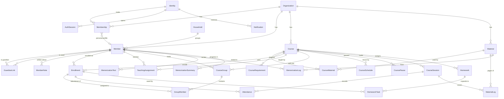
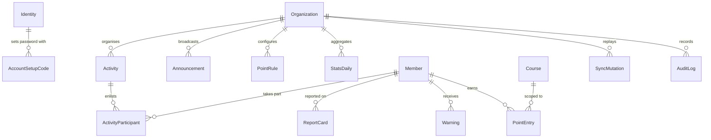

# 02 — Domain model

> Source of truth for entities and invariants. Physical schema lives in
> `apps/api/prisma/schema.prisma` and must match this document.

---

## 1. Glossary

| Term | Meaning |
| --- | --- |
| **Platform** | Ribat itself, operated by the SaaS owner |
| **Organization** | One mosque. The tenant boundary |
| **Identity** | A login (phone + password). Platform-wide |
| **Membership** | An identity's role inside one organization |
| **Member** | A person record inside one organization (student, teacher, guardian, or all three) |
| **Household** | A family grouping. Members of one household are siblings |
| **Course** | A teaching unit. Memorization, explanation, or both |
| **Material** | Something studied: the Quran, a text (matn), or a book. Organization-level catalogue |
| **Group (حلقة)** | Students assigned to one teacher, optionally for one material, inside a course |
| **Session** | One class meeting on a date |
| **Enrollment** | A member's place in a course |
| **Memorization log** | One recitation record: new memorization or revision |
| **Material log** | The pages an explanation class covered in one session |
| **Class kit** | The data a teacher's phone caches so class mode works offline |

---

## 2. ERD — beta entities

## 3. ERD — system and after-beta entities

---

## 4. Platform and tenancy

### Organization

| Field | Type | Notes |
| --- | --- | --- |
| id | uuid | |
| name, slug | text | slug unique platform-wide |
| status | enum | `ACTIVE`, `SUSPENDED` |
| timezone | text | `Asia/Damascus` |
| latitude, longitude | numeric | for prayer-anchored class times (OQ-9) |
| prayerMethod, prayerOffsets | text, jsonb | calculation method and per-prayer minute offsets |
| settings | jsonb | locale default, points enabled, plan limits |
| createdAt, updatedAt | timestamptz | |

### Identity

| Field | Type | Notes |
| --- | --- | --- |
| id | uuid | |
| phone | text | unique platform-wide, E.164 |
| passwordHash | text | argon2id, nullable until the setup code is used |
| platformRole | enum | `OWNER`, `NONE` — only one `OWNER` exists (DM-03) |
| status | enum | `ACTIVE`, `DISABLED` |
| lastLoginAt | timestamptz | |

### Membership

| Field | Type | Notes |
| --- | --- | --- |
| id, organizationId, identityId | uuid | unique(identityId, organizationId) |
| role | enum | `SHEIKH`, `ORG_ADMIN`, `MEMBER`, `GUARDIAN` |
| memberId | uuid? | the person record this login acts as |
| status | enum | `ACTIVE`, `SUSPENDED` |

### AuthSession

| Field | Type | Notes |
| --- | --- | --- |
| id, identityId | uuid | |
| tokenHash | text | the cookie value is never stored raw |
| deviceLabel, userAgent | text | shown in "my devices" |
| createdAt, lastSeenAt, expiresAt, revokedAt | timestamptz | one-year rolling expiry (OQ-6) |

### AccountSetupCode

| Field | Type | Notes |
| --- | --- | --- |
| id, identityId | uuid | |
| codeHash | text | one-time, hashed |
| expiresAt, usedAt | timestamptz | |
| createdByMembershipId | uuid | who issued it, for the audit trail |

---

## 5. People

### Member

| Field | Type | Notes |
| --- | --- | --- |
| id, organizationId | uuid | |
| householdId | uuid? | siblings share a household |
| firstName, fatherName, familyName | text | required |
| motherName | text? | |
| birthDate | date | required — drives age rules and the card |
| phone | text? | |
| address, schoolGrade, schoolName | text? | |
| joinedAt | date | |
| notes | text? | staff notes on the card |
| status | enum | `ACTIVE`, `ARCHIVED` |
| createdAt, updatedAt, archivedAt | timestamptz | no hard delete (DM-12) |

A member has a login only when a `Membership` points at them. A guardian who has no login is
just a `Member` row with contact details (decision 14.3).

### Household

`id`, `organizationId`, `name`. Members in the same household are siblings (decision 2.8).

### GuardianLink

| Field | Type | Notes |
| --- | --- | --- |
| id, organizationId | uuid | |
| guardianMemberId, wardMemberId | uuid | unique together |
| relation | enum | `FATHER`, `MOTHER`, `OTHER` |
| isPrimary | bool | who gets contacted first |

### MemberNote

| Field | Type | Notes |
| --- | --- | --- |
| id, organizationId, memberId | uuid | |
| courseId | uuid? | the course the note came from |
| authorMemberId | uuid | usually a teacher |
| body | text | |
| visibility | enum | `SHEIKH_ONLY` (default), `STAFF` — never visible to guardians or the student (decision 2.12) |
| createdAt | timestamptz | |

---

## 6. Courses and teaching

### Course

| Field | Type | Notes |
| --- | --- | --- |
| id, organizationId | uuid | |
| name, description | text | |
| type | enum | `MEMORIZATION`, `EXPLANATION`, `BOTH` (decision 4.3) |
| status | enum | `DRAFT`, `ACTIVE`, `PAUSED`, `FINISHED`, `ARCHIVED` (OQ-1) |
| startDate, endDate | date? | |
| location | text? | |
| minAge, maxAge, capacity | int? | |
| isHierarchical | bool | toggle 1 — several teachers |
| hasGroups | bool | toggle 2 — students assigned per teacher |
| testPassMark | int | default 60, used by memorization tests |
| pointsEnabled, leaderboardEnabled | bool | the points system is optional (decision 11.0) |
| leaderboardPeriod | enum | `WEEKLY`, `MONTHLY`, `ALL_TIME` (OQ-7) |
| createdAt, updatedAt | timestamptz | |

### CourseRequirement

`id`, `courseId`, `type` (`MIN_AGE`, `MAX_AGE`, `MEMORIZED_PAGES`, `COMPLETED_COURSE`,
`MANUAL`), `value` jsonb, `description`. Checked when enrolling and shown as a warning; it
never blocks the sheikh (decision 4.1).

### Material and CourseMaterial

`Material` is the organization's catalogue, so a lifetime memorization record survives across
courses.

| Field | Type | Notes |
| --- | --- | --- |
| id, organizationId | uuid | |
| kind | enum | `QURAN`, `TEXT`, `BOOK` |
| title, author | text | one `QURAN` row is seeded per organization |
| totalPages | int? | 604 for the Quran |
| url | text? | external link only (decision 7.3) |
| createdAt, archivedAt | timestamptz | |

`CourseMaterial`: `id`, `courseId`, `materialId`, `track` (`MEMORIZATION` or `EXPLANATION`),
`order`. Unique on (courseId, materialId).

### Enrollment

`id`, `organizationId`, `courseId`, `memberId`, `status` (`ACTIVE`, `WITHDRAWN`,
`COMPLETED`), `startedAt`, `endedAt`. Unique on (courseId, memberId).

### TeachingAssignment

`id`, `organizationId`, `courseId`, `teacherMemberId`, `role` (`LEAD`, `TEACHER`),
`createdAt`, `endedAt`. Unique on (courseId, teacherMemberId). History is kept (decision 5.5).

### CourseGroup and GroupMember

A group is one teacher's students inside a course, optionally for a single material — because
a student may have a different teacher per material (decision 5.4).

`CourseGroup`: `id`, `organizationId`, `courseId`, `name`, `teacherMemberId`, `materialId?`,
`materialKey`.

`materialKey` is a stored column equal to `materialId::text` or `'ALL'` when the group covers
every material. `CourseGroup` carries a unique index on (id, materialKey).

`GroupMember`: `id`, `organizationId`, `groupId`, `materialKey`, `enrollmentId`, with

- a composite foreign key (groupId, materialKey) → CourseGroup(id, materialKey), and
- a unique index on (enrollmentId, materialKey).

Together these make DM-06 impossible to violate from any code path, including the offline
queue. The composite key needs a hand-written SQL migration; Prisma cannot express it alone.

---

## 7. Scheduling and attendance

### CourseSchedule

| Field | Type | Notes |
| --- | --- | --- |
| id, organizationId, courseId | uuid | |
| weekday | int | 0–6 |
| startAnchor | enum | `FIXED` or `PRAYER` (decision 4.7) |
| startTime | time? | when `FIXED` |
| startPrayer | enum? | `FAJR`…`ISHA`, when `PRAYER` |
| startOffsetMin | int | minutes after the adhan |
| endAnchor, endTime, endPrayer, endOffsetMin | | same shape |
| effectiveFrom, effectiveTo | date? | schedule changes keep history |

### CoursePause

`id`, `courseId`, `fromDate`, `toDate`, `reason`. Sessions are not generated and no absence is
recorded inside a pause (decision 4.9).

### CourseSession

| Field | Type | Notes |
| --- | --- | --- |
| id, organizationId, courseId | uuid | |
| date | date | |
| startsAt, endsAt | timestamptz | prayer anchors resolved when the session is generated |
| status | enum | `SCHEDULED`, `HELD`, `CANCELLED` |
| topic | text? | |
| scheduleId | uuid? | null when added by hand |
| isException | bool | |

Unique on (courseId, date, startsAt). "Not taken" is derived: the session is past, not
cancelled, and has no attendance rows (decision 8.6).

### Attendance

| Field | Type | Notes |
| --- | --- | --- |
| id, organizationId, sessionId, enrollmentId | uuid | unique(sessionId, enrollmentId) |
| status | enum | `PRESENT`, `ABSENT`, `LATE`, `EXCUSED` (decision 8.1) |
| markedByMemberId | uuid | |
| markedAt | timestamptz | the client's time of marking — decides last-writer-wins |
| source | enum | `ONLINE`, `OFFLINE` |
| idempotencyKey | uuid | unique per organization |
| supersededCount | int | how often it was overwritten, for the conflict notice |
| createdAt, updatedAt | timestamptz | every change also writes an `AuditLog` row |

### ExcuseRequest

`id`, `organizationId`, `memberId`, `courseId?`, `fromDate`, `toDate`, `reason`,
`submittedByIdentityId`, `status` (`PENDING`, `ACCEPTED`, `REJECTED`), `decidedBy`,
`decidedAt`. Accepting one sets matching attendance rows to `EXCUSED` (decision 8.3).

---

## 8. Progress

### MemorizationLog

Append-only. One row per recitation (decision 6.3, 6.7).

| Field | Type | Notes |
| --- | --- | --- |
| id, organizationId, memberId, materialId | uuid | |
| courseId | uuid? | null for a starting-level entry |
| type | enum | `NEW`, `REVISION`, `INITIAL` (decision 6.9) |
| surahStart, ayahStart, surahEnd, ayahEnd | int? | required when the material is `QURAN` |
| pageFrom, pageTo | int | computed from the ayah range for the Quran; given directly for a text |
| ayahCount | int? | |
| grade | enum? | `EXCELLENT`, `VERY_GOOD`, `GOOD`, `REPEAT` |
| mistakes | int | default 0 |
| note | text? | |
| loggedByMemberId | uuid | |
| loggedAt | timestamptz | class time, from the client |
| source | enum | `ONLINE`, `OFFLINE` |
| idempotencyKey | uuid | unique per organization |
| voidedAt, voidedByMemberId, voidReason | | corrections void a row instead of editing it (DM-08) |

### MemorizationTest

`id`, `organizationId`, `memberId`, `materialId`, `courseId?`, `scopeType`
(`JUZ`, `SURAH`, `RANGE`, `TEXT_PAGES`), `juz?`, the same range fields, `score` (0–100),
`passMark`, `passed`, `attemptNo`, `examinerMemberId`, `takenAt`, `notes`, `idempotencyKey`.
Every attempt is kept (decision 6.5).

### MemorizationSummary

Derived, written in the same transaction as a log, so the offline kit and the member card
stay cheap.

`id`, `organizationId`, `memberId`, `materialId`, `pagesMemorized`, `ayahsMemorized`,
`lastPageReached`, `lastSurah`, `lastAyah`, `lastLoggedAt`, `updatedAt`.
Unique on (memberId, materialId).

### MaterialLog (explanation)

Logged once per class or group, not per student (decision 7.1).

`id`, `organizationId`, `sessionId`, `materialId`, `groupId?`, `pageFrom`, `pageTo`, `note`,
`loggedByMemberId`, `loggedAt`, `source`, `idempotencyKey`.

---

## 9. Homework

`Homework`: `id`, `organizationId`, `courseId`, `targetType` (`COURSE`, `GROUP`, `MEMBER`),
`groupId?`, `memberId?`, `title`, `description?`, `dueDate`, `createdByMemberId`, `createdAt`
(decision 10.2).

`HomeworkTask`: `id`, `organizationId`, `homeworkId`, `enrollmentId`, `status` (`ASSIGNED`,
`DONE`, `MISSED`), `markedByMemberId?`, `markedAt?`. Rows are expanded when the homework is
created, so a guardian's list is a single indexed query. No points and no warnings are
attached (decision 10.3).

---

## 10. Communication

### Notification

| Field | Type | Notes |
| --- | --- | --- |
| id, organizationId, recipientIdentityId | uuid | |
| type | enum | `ABSENCE_SUMMARY`, `LATE`, `TEST_RESULT`, `HOMEWORK_ASSIGNED`, `HOMEWORK_MISSED`, `SCHEDULE_CHANGE`, `WARNING`, `REPORT_CARD`, `ANNOUNCEMENT`, `ACTIVITY_INVITE` |
| titleKey, bodyKey | text | i18n keys, not rendered text |
| params | jsonb | values interpolated in the reader's language |
| entityType, entityId | text, uuid | deep link target |
| readAt, createdAt | timestamptz | |

Storing keys and parameters instead of finished sentences is what lets the same notification
render in Arabic for a parent and English for a reviewer on the demo (NFR-01).

Recipients per event follow decision 15.2.

---

## 11. After-beta entities (schema ready, features later)

| Entity | Key fields |
| --- | --- |
| **PointRule** | `organizationId`, `courseId?`, `event`, `value`, `enabled` — course overrides the organization |
| **PointEntry** | append-only ledger: `memberId`, `courseId?`, `source` (`AUTO`/`MANUAL`), `event?`, `value`, `reason`, `createdByMemberId?`, `refType`, `refId`, `idempotencyKey` |
| **Warning** | `memberId`, `courseId?`, `body` (free text), `status` (`PROPOSED`, `PUBLISHED`), `proposedByMemberId`, `publishedByMembershipId`, `publishedAt`, `pointsDeducted?` |
| **ReportCard** | `memberId`, `courseId?`, `periodStart`, `periodEnd`, `content` jsonb, `teacherComment`, `status`, `publishedAt` — generated manually, shown in-app |
| **Announcement** | `audience` (`ALL`, `COURSE`, `GUARDIANS`), `courseId?`, `title`, `body`, `publishedBy`, `publishedAt` |
| **Activity** | `name`, `kind` (`ONE_TIME`, `RECURRING`), `courseId?` or criteria, `startsAt`, `endsAt`, `location` |
| **ActivityParticipant** | `activityId`, `memberId`, `status` (`ENLISTED`, `WITHDRAWN`) |

---

## 12. System entities

| Entity | Purpose |
| --- | --- |
| **AuditLog** | Append-only: `actorIdentityId`, `actorMembershipId`, `action`, `entityType`, `entityId`, `before`, `after`, `requestId`, `createdAt` (decision 19.4) |
| **SyncMutation** | One row per replayed offline mutation: `idempotencyKey` (unique per organization), `type`, `status` (`APPLIED`, `REJECTED`, `SUPERSEDED`), `result` jsonb — see [05-offline-sync.md](./05-offline-sync.md) |
| **StatsDaily** | Nightly aggregates: `date`, `scopeType` (`ORG`, `COURSE`, `TEACHER`, `MEMBER`), `scopeId`, `metrics` jsonb (NFR-10) |
| **DomainEvent** | From S4: written in the same transaction as the domain change it describes; `type`, `aggregateType`, `aggregateId`, `payload`, `requestId`, `occurredAt`, `dispatchedAt` — see [07-events-and-jobs.md](./07-events-and-jobs.md) |
| **EventDelivery** | One row per `(eventId, handler)`, unique: `status`, `attempts`, `lastError`, `nextAttemptAt`. Dead letters surface in a staff view |

---

## 13. Reference data — the Quran

Shipped as a static dataset in `packages/quran-data`, not as tenant rows:

- 114 surahs with ayah counts and Arabic/English names
- the ayah → page map for the **604-page Madinah mushaf** (decision 6.2)
- helpers: `pagesForRange()`, `validateRange()`, `mergeRanges()`

The API uses it to compute `pageFrom`/`pageTo` and to validate ranges; the PWA bundles it so
the range picker works offline.

---

## 14. Invariants

| # | Rule |
| --- | --- |
| DM-01 | Every tenant-owned row carries `organizationId`, and every query filters on it |
| DM-02 | Cross-tenant access returns **404**; a same-tenant permission denial returns **403** |
| DM-03 | Exactly one `OWNER` identity platform-wide; exactly one `SHEIKH` membership per organization |
| DM-04 | A `Membership.memberId` must belong to the same organization as the membership |
| DM-05 | Enrollment exists only on a course, never on a group; unique per (course, member) |
| DM-06 | A student has **at most one teacher per material** in a course, enforced by the composite key in §6 |
| DM-07 | Groups exist only while `isHierarchical` and `hasGroups` are true; a toggle cannot be switched off while assignments exist (decision 5.6) |
| DM-08 | Memorization logs, material logs, point entries and audit rows are **append-only**. A mistake is voided with a reason, never edited or deleted |
| DM-09 | Attendance is unique per (session, enrollment); the row with the latest `markedAt` wins, and every overwrite is audited |
| DM-10 | `idempotencyKey` is unique per organization across every offline-writable table |
| DM-11 | A memorization log's range must validate against the Quran dataset when the material is `QURAN` |
| DM-12 | Members are archived, never hard-deleted; history survives (decision 14.6, 19.3) |
| DM-13 | Teacher notes (`MemberNote`) are never visible to guardians or students |
| DM-14 | A guardian may read only their linked wards' data, and only what is published |
| DM-15 | Points are inert while `pointsEnabled` is false — rules do not fire and no ledger rows are written |

---

## 15. Indexing notes

| Table | Index |
| --- | --- |
| every tenant table | `(organizationId, id)`, plus `(organizationId, status)` where filtered |
| Attendance | `(sessionId)`, `(enrollmentId, markedAt desc)` |
| MemorizationLog | `(organizationId, memberId, loggedAt desc)`, `(courseId, loggedAt desc)`, `(materialId, memberId)` |
| CourseSession | `(organizationId, date)`, `(courseId, date)` |
| Notification | `(recipientIdentityId, readAt, createdAt desc)` |
| HomeworkTask | `(enrollmentId, status)`, `(homeworkId)` |
| AuditLog | `(organizationId, entityType, entityId, createdAt desc)` |
| Member | `(organizationId, familyName, firstName)` for name search; trigram index if search gets slow |
