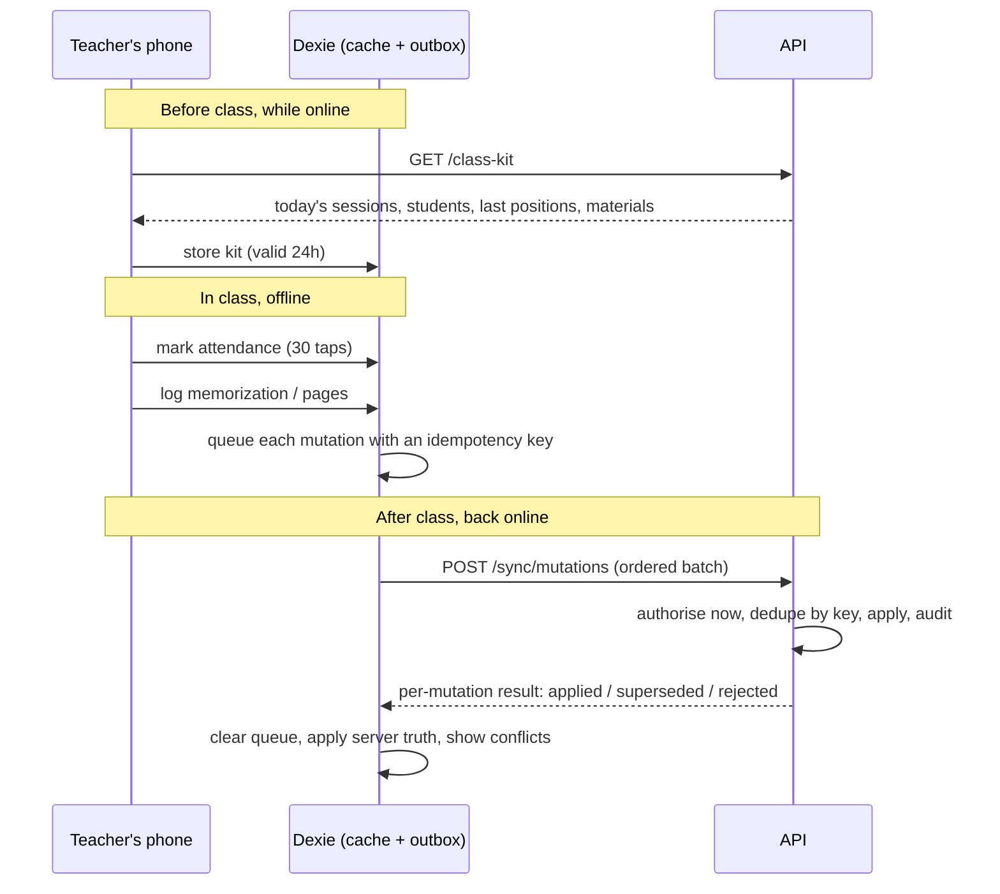

# 04 — Workflows

> The flows the beta must support, in the order they happen in real life.
> `WF-*` IDs are referenced by tests.

---

## WF-01 · Onboarding a mosque

Two paths, one codebase ([ADR-0008](./adr/0008-distribution-model.md)).

### Self-hosted (`DEPLOY_MODE=self_host`)

1. Someone runs `docker compose up` with a filled `.env`. Migrations run at boot.
2. The first visit to the app opens a **setup page**, available only while no organization
   exists: mosque name, timezone, coordinates and prayer method, default language, and the
   sheikh's name and phone.
3. Submitting it creates the `Organization`, seeds its `QURAN` material, creates the sheikh's
   `Identity`, `Member` and `Membership(role=SHEIKH)`, and shows the one-time setup code once.
4. The sheikh signs in with phone + code and sets a password. The setup page is closed
   permanently.

### Hosted (`DEPLOY_MODE=hosted`)

The control plane provisions the organization through the platform API after a customer signs
up (`POST /platform/organizations`), passing the plan's member limit into
`Organization.settings`, and delivers the sheikh's setup code. Steps 3–4 are identical.

**Rules:** exactly one sheikh (DM-03). The platform owner never gains access to the
organization's data (PERM-02). The setup code is shown once and stored hashed. The setup page
refuses to run once any organization exists, in either mode.

---

## WF-02 · Creating an account and first login

1. Staff open a member and choose **Give app access**.
2. The API creates an `Identity` for the member's phone (or reuses it), a `Membership` with
   the chosen role, and an `AccountSetupCode` valid for 7 days.
3. Staff read the code to the person, or send it over WhatsApp from the member card.
4. The person opens the app: phone + code → set a password → logged in.
5. The session is a one-year rolling cookie; the person stays logged in (decision 3.6).

**Rules:** no self-signup (decision 3.3). A forgotten password is a new code issued by staff
(decision 3.2). Under 12, no login is created; the guardian's account covers the child
(decision 2.7). Code issuance and redemption are audited.

---

## WF-03 · Adding a member with family

One form, one transaction:

1. Name (first / father / family), birth date, phone, address, school grade and name, join
   date, notes.
2. **Guardians:** search existing members by name, or create a contact-only guardian (name +
   phone, no login). One or more, with relation and a primary flag.
3. **Siblings:** search for an existing sibling. Picking one puts both members in that
   sibling's household; if they have none, a household is created (decision 2.8).
4. Optional: give app access now (WF-02).

**Rules:** guardians and siblings must belong to the same organization (DM-04). A
contact-only guardian can be upgraded to a login later without losing links (decision 14.3).

---

## WF-04 · Setting up a course

1. **Create:** name, description, type (memorization, explanation or both), dates, location,
   age range, capacity.
2. **Requirements** (optional): minimum age, pages already memorized, a completed course, or
   a free-text condition. These warn at enrollment; they never block staff (decision 4.1).
3. **Materials:** pick from the organization's catalogue or add one (title, author, total
   pages, link). Each is marked as a memorization or explanation track. Only staff may create
   materials (OQ-3).
4. **Teachers:** type a name to assign existing members. The first is the lead.
5. **Toggle 1 — hierarchical:** allows several teachers. Off means one lead teaches everyone.
6. **Toggle 2 — groups:** allows students to be assigned per teacher. With groups on, staff
   create a group per teacher and add students. A group may be limited to one material, so a
   student can have one teacher for Quran and another for a text (decision 5.4, DM-06).
7. **Schedule:** weekday rows, each starting at a fixed time or a prayer with an offset, and
   ending the same way — "from Asr to 6pm" is `startAnchor=PRAYER(ASR)`, `endAnchor=FIXED(18:00)`.
8. **Enroll students:** staff add them directly (decision 4.4).

Saving the schedule enqueues `sessions.generate` for the next four weeks.

**Rules:** a toggle cannot be switched off while assignments exist (DM-07). Teachers cannot
enroll or move students (PERM-04 matrix).

---

## WF-05 · Class mode (the core flow)

Assume no internet for the whole class (decision 9.1).

Steps on screen:

1. Teacher opens **Today** → their sessions for the day (from the cache).
2. Opens a session → the student list, sorted by name, with each student's last position
   shown ("last: page 42, An-Naba 1–15").
3. Taps a student once to cycle attendance, or uses "mark all present" and corrects the rest.
4. Taps **Log** on a student → type (new / revision), ayah range picker (validated offline by
   `packages/quran-data`), grade, mistakes, optional note. Three taps for the common case
   (NFR-05).
5. For an explanation course, the teacher logs pages once for the class, with a note
   (decision 7.1).
6. A badge shows how many changes are queued and when the phone last synced (decision 9.6).

**Rules:** a teacher sees only their own group's students (PERM-11). The kit contains no data
the teacher may not see (PERM-07). Nothing is lost if the app is closed: the queue is
persisted, not in memory.

---

## WF-06 · Sync and conflicts

Full contract in [05-offline-sync.md](./05-offline-sync.md). The short version:

- Mutations replay **in creation order**, each carrying a client-generated idempotency key.
- A repeated key is answered with the original result, never applied twice (DM-10).
- Attendance conflicts resolve by the latest `markedAt`; the loser is kept in the audit log
  and the overridden person gets a notification (decision 9.4).
- Progress logs never conflict: they are append-only, deduped by key (DM-08).
- Permissions are evaluated at **replay time**, not at capture time (PERM-12).

---

## WF-07 · Memorization test

1. A teacher or the sheikh opens a student and chooses **Test**.
2. Picks the scope (a juz, a surah, a range, or text pages), enters a score out of 100 and
   notes.
3. The API compares the score with the course's pass mark, stores `passed` and the attempt
   number, and keeps every earlier attempt (decision 6.5).
4. Guardian, student and teacher get a notification (decision 15.2).

---

## WF-08 · A guardian's week

| Moment | What they see |
| --- | --- |
| Any time | A weekly timetable of each child's courses and activities, Hijri and Gregorian (decision 16.1) |
| Any time | The child's card: attendance, memorization progress, tests, homework |
| Before an absence | Submit an excuse for a date range with a reason; staff accept it and matching attendance becomes `EXCUSED` (decision 8.3) |
| Every evening | One summary notification per child listing that day's absences and lateness (decision 8.4) |
| When homework is set | A notification, and reminders while it is open (decision 10.4) |

Guardians never see teacher notes (DM-13) or other families' data (DM-14).

---

## WF-09 · The sheikh's evening

1. **Dashboard:** attendance rate per course and per teacher, pages memorized this week,
   tests passed, top students, and **teachers who have not logged** (decision 17.1). Read from
   `StatsDaily`, refreshed nightly (NFR-10).
2. **Not-taken alert:** sessions that ended with no attendance (decision 8.6).
3. **Notes:** teacher notes written about students, visible to the sheikh only (decision 2.12).
4. **Corrections:** the sheikh may fix any attendance or void any log, with a reason. Every
   correction is audited (PERM-13).

---

## WF-10 · A member leaves

Staff archive the member: status becomes `ARCHIVED`, enrollments close, logins are disabled,
and all history stays queryable (decision 14.6). There is no delete, and guardians cannot
request one (decision 19.3).

---

## After-beta flows (sketch)

| # | Flow |
| --- | --- |
| WF-11 | **Warning:** a teacher proposes free text → the sheikh or admin publishes it → guardian, student and teacher are notified; no read receipt, no expiry, optionally deducts points (decisions 12.1–12.4) |
| WF-12 | **Report card:** staff pick a member and a period → the app drafts attendance, memorization, tests and homework → the teacher adds a comment → the sheikh publishes → it appears in-app and can be shared as a WhatsApp link (decision 15.3, OQ-8) |
| WF-13 | **Points:** rules fire on attendance, memorization, tests and activities while `pointsEnabled` is on; manual entries need a reason; the per-course leaderboard is visible to that course's members (decisions 11.0–11.6) |
| WF-14 | **Announcement:** the sheikh writes once, the fan-out job creates notifications for the audience (decision 15.4) |
